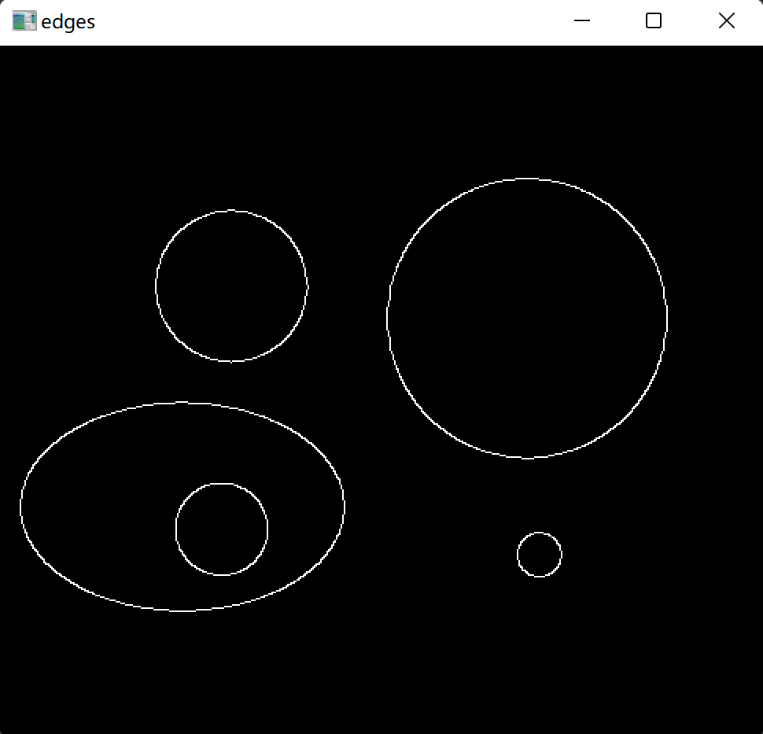
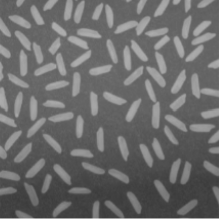
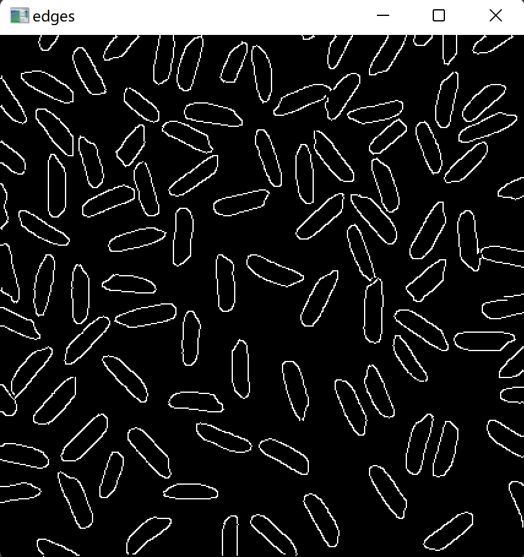
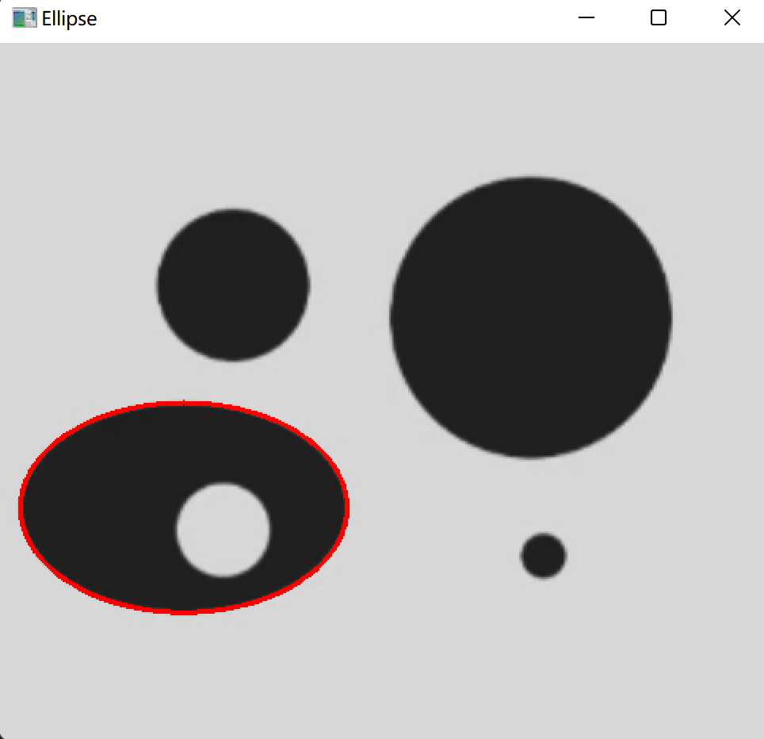
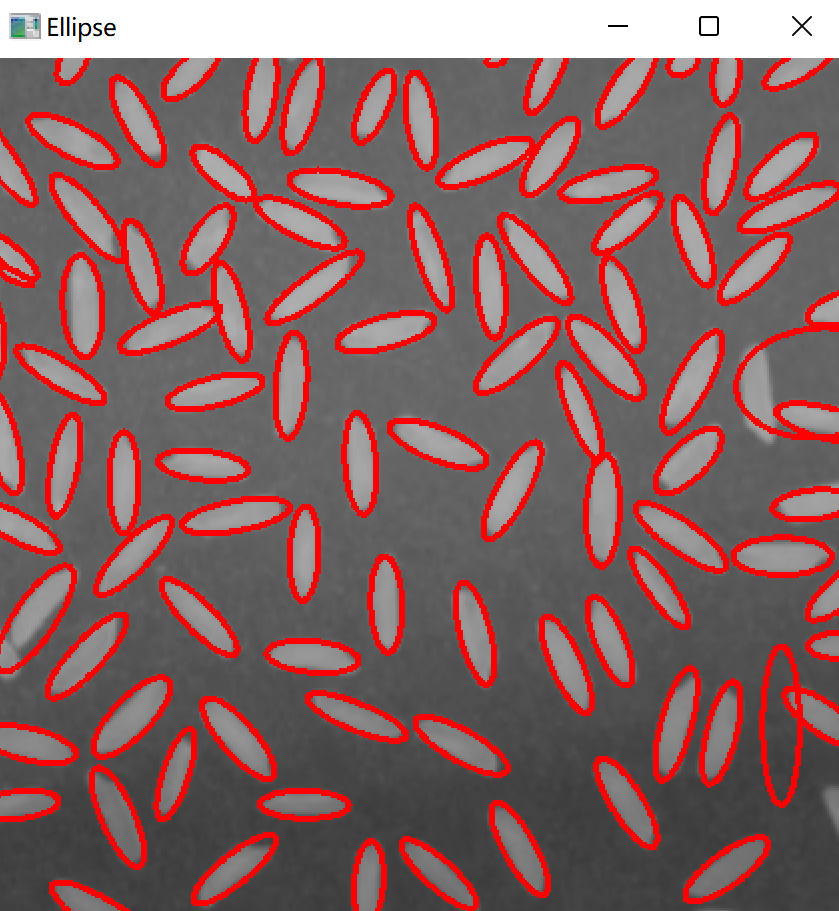

<br/>
<br/>
<br/>
<br/>
<br/>
<br/>
<br/>
<br/>
<br/>
<br/>
<br/>
<br/>

<center>
<center><font face="黑体" size = 100>
    《计算机视觉》实验报告
  </font></center>
  <br/>
<br/>
<br/>
<br/>
<br/>
<br/>
  <center><font face="黑体" size = 5>
    姓名：韩艺轩
  </font></center>
  <center><font face="黑体" size = 5>
    学院：计算机科学与技术学院
  </font></center>
  <center><font face="黑体" size = 5>
    专业：计算机科学与技术（图灵班）
  </font></center>
  <center><font face="黑体" size = 5>
    邮箱：2674361965@qq.com
  </font></center> 
  <center><font face="黑体" size = 5>
    指导教师：宋明黎
  </font></center>
</center>

<center>
<font face="黑体" size = 5>
    报告日期: 2023/12/13
  </font>
</center> 

<div STYLE="page-break-after: always;"></div>
<!-- TOC -->

- [HW2 椭圆拟合](#hw2-椭圆拟合)
  - [实验实现的功能简述及运行说明](#实验实现的功能简述及运行说明)
  - [作业的开发与运行环境](#作业的开发与运行环境)
    - [算法的基本思路、原理及流程](#算法的基本思路原理及流程)
    - [读入图片](#读入图片)
    - [边缘检测](#边缘检测)
    - [椭圆拟合](#椭圆拟合)
  - [实验结果与分析](#实验结果与分析)

<!-- /TOC -->

<div STYLE="page-break-after: always;"></div>

# HW2 椭圆拟合

## 实验实现的功能简述及运行说明

本次实验实现将图片中的椭圆通过椭圆拟合标记出来。输入一张图片，在原图片上将图中的椭圆标记出来。

## 作业的开发与运行环境

- Windows 11
- Pycharm
- opencv-python 4.8.1.78

### 算法的基本思路、原理及流程

### 读入图片

将图片读入并转化成灰度图像，有利于后续的边缘检测。然后利用cv2.GaussianBlur()去除噪声，提高边缘检测的准确度。
```python
img = cv2.imread('./test.png')
img_gray = cv2.cvtColor(img, cv2.COLOR_BGR2GRAY)
img_blur = cv2.GaussianBlur(img_gray, (3, 3), 0)
```

### 边缘检测

使用 Canny()进行边缘检测并进行二值膨胀。
```python
edges = cv2.Canny(image=img_blur, threshold1=60, threshold2=120)
kernel = np.ones((1, 1), np.uint8)
edges = cv2.dilate(edges, kernel, iterations=1)
```

展示效果

原图

边缘


原图

边缘


### 椭圆拟合

虽然作业要求使用CvBox2D cvFitEllipse2(const CvArr *points)函数实现拟合，但考虑到其实本次实验cpp与python实现的难度相差不大，采用了python的cv2.fitEllipse()函数实现椭圆拟合。

首先收集边缘检测后得到的轮廓，然后针对每个轮廓，获得点集，将点集进行椭圆拟合，然后得到椭圆的数据，但是对于特征点少于10个的椭圆可以看作是误判。并且在这里为了防止圆形也被检测成近似椭圆，我给定了一个判断，如果拟合的椭圆的长轴与短轴之比小于1.05，可以被认为是边缘检测的误差引起的将圆误判成椭圆。然后将椭圆用红线标记出来。
```python 
contours, _ = cv2.findContours(edges, cv2.RETR_EXTERNAL, cv2.CHAIN_APPROX_SIMPLE)

for contour in contours:
    if len(contour) < 10:
        continue
    points = contour.reshape(-1, 2)
    ellipse = cv2.fitEllipse(points)
    _, axes, _ = ellipse
    major_axis, minor_axis = axes
    if abs(major_axis) > abs(minor_axis):
        e = abs(major_axis) / abs(minor_axis)
    else:
        e = abs(minor_axis) / abs(major_axis)
    if e < 1.05:
        continue
    cv2.ellipse(img, ellipse, (0, 0, 255), 2)
```

## 实验结果与分析

原图

结果


原图

结果
