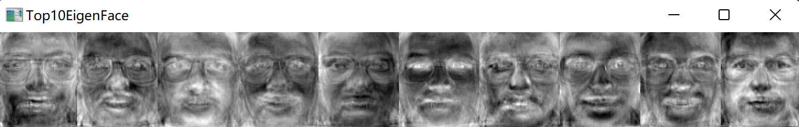
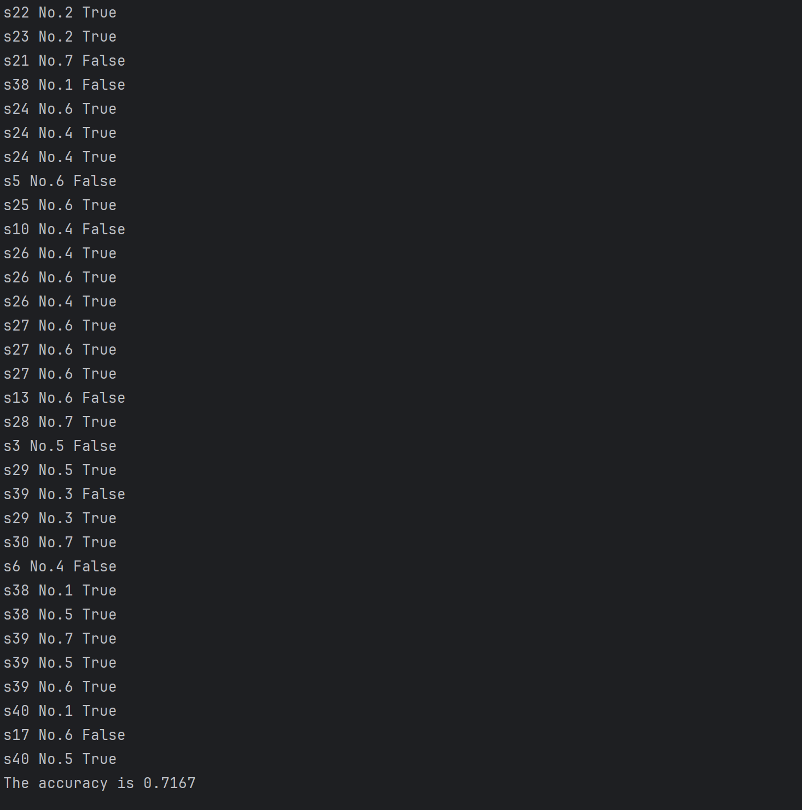
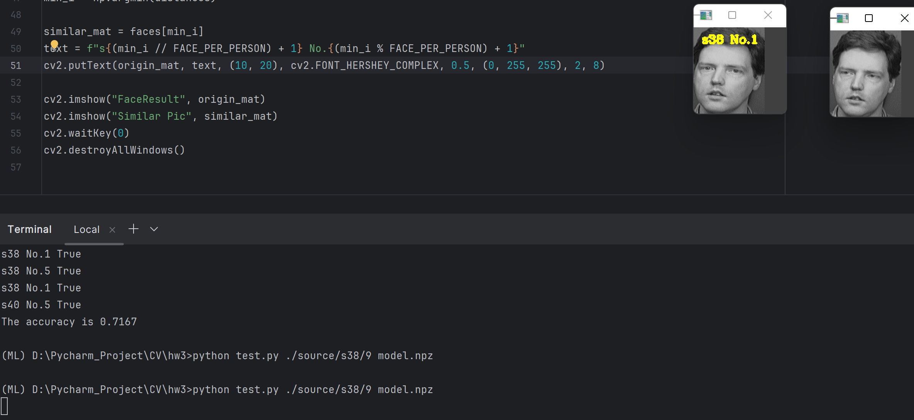

<br/>
<br/>
<br/>
<br/>
<br/>
<br/>
<br/>
<br/>
<br/>
<br/>
<br/>
<br/>

<center>
<center><font face="黑体" size = 100>
    《计算机视觉》实验报告
  </font></center>
  <br/>
<br/>
<br/>
<br/>
<br/>
<br/>
  <center><font face="黑体" size = 5>
    姓名：韩艺轩
  </font></center>
  <center><font face="黑体" size = 5>
    学院：计算机科学与技术学院
  </font></center>
  <center><font face="黑体" size = 5>
    专业：计算机科学与技术（图灵班）
  </font></center>
  <center><font face="黑体" size = 5>
    邮箱：2674361965@qq.com
  </font></center> 
  <center><font face="黑体" size = 5>
    指导教师：宋明黎
  </font></center>
</center>

<center>
<font face="黑体" size = 5>
    报告日期: 2023/12/20
  </font>
</center> 

<div STYLE="page-break-after: always;"></div>
<!-- TOC -->

- [HW3 Eigenface 人脸识别](#hw3-eigenface-人脸识别)
  - [实验实现的功能简述及运行说明](#实验实现的功能简述及运行说明)
  - [作业的开发与运行环境](#作业的开发与运行环境)
  - [算法的基本思路、原理及流程](#算法的基本思路原理及流程)
    - [处理图片](#处理图片)
    - [训练模型](#训练模型)
    - [测试](#测试)
  - [实验结果与分析](#实验结果与分析)
    - [训练结果](#训练结果)
    - [测试集](#测试集)

<!-- /TOC -->

<div STYLE="page-break-after: always;"></div>

# HW3 Eigenface 人脸识别

## 实验实现的功能简述及运行说明

本次实验在没有调用OpenCV里面与Eigenface相关函数的情况下实现了Eigenface人脸识别，利用人脸库（包括照片和眼睛位置），将人脸库分为训练集和测试集（比例可以通过改变参数调整），使用训练集训练一个人脸识别的模型，然后在测试集中选择一张图片，使用模型识别出是训练集中的哪个人。

训练程序使用格式 
```
python train.py 能量百分比 model文件名。
```
训练程序用能量百分比决定取多少特征脸，将训练结果输出保存到model文件中。同时将前十个特征脸拼成一张图像，然后显示出来。

识别程序使用格式
```
python test.py 人脸图像文件名 model文件名
```
将model文件加载进来，对输入的人脸图像进行识别，并将识别结果叠加在输入的人脸图像上显示出来，同时显示人脸库中跟该人脸图像最相似的图像。

## 作业的开发与运行环境

- Windows 11
- Pycharm
- opencv-python 4.8.1.78

## 算法的基本思路、原理及流程

### 处理图片

对于每个样本，命名为 s${n},每个样本都有自己的一个文件夹，其中有编号 1.pgm - 10.pgm 的十张图片，以及记录眼睛位置的 1.txt - 10.txt， 只需要一个能够找到该样本的路径就可以加载该样本并处理该样本。

对于每张图片，读取眼睛的位置,并读入原图和灰度图。
```python
with open(path + ".txt", "r") as file:
        line = file.readline()
        number = line.split()
x1, y1, x2, y2 = float(number[0]), float(number[1]), float(number[2]), float(number[3])
origin_image = cv2.imread(path + ".pgm", cv2.IMREAD_COLOR)
grey_image = cv2.imread(path + ".pgm", cv2.IMREAD_GRAYSCALE)
```

计算出两只眼睛的中心点，由此得出两只眼睛倾斜角度，然后通过仿射变换（旋转+缩放+平移），使两只眼睛水平并使两只眼睛对齐到确定模板的位置。改变图片的size来让人脸尽可能的占满图片。
```python
center = ((x1 + x2) / 2, (y1 + y2) / 2)
angle = np.arctan2(y2 - y1, x2 - x1) * 180.0 / np.pi
trans_mat = cv2.getRotationMatrix2D(center, angle, 1.0)
trans_mat[0, 2] += 37 - center[0]
trans_mat[1, 2] += 30 - center[1]
transformed_pic = cv2.warpAffine(grey_image, trans_mat,
                                          (int(grey_image.shape[1] * 0.8), int(grey_image.shape[0] * 0.8)),
                                          flags=cv2.INTER_LINEAR, borderMode=cv2.BORDER_CONSTANT,
                                          borderValue=(0.0, 0.0, 0.0))
```

为了让光照条件对人脸的影响变小，仿射变换完成之后，对灰度图进行直方图均衡化equalizeHist。然后将$M \times N$的图片矩阵转换为$MN \times 1$的矩阵。
```python
transformed_pic = cv2.equalizeHist(transformed_pic)
equalized_mat = transformed_pic.copy()
vect = equalized_mat.reshape(1, -1).T
```

为了处理所有的样本，写一个循环来逐个处理每个样本。

```python
faces = []
    vects = []
    for i in range(1, person_num + 1):
        for j in range(1, face_per_person + 1):
            path_ = "{}/s{}/{}".format(path, i, j)
            vect, origin_image = Face(path_)
            faces.append(origin_image)
            vects.append(vect)
    samples = cv2.hconcat(vects)
```

### 训练模型

首先读入命令行参数
```python
parser = argparse.ArgumentParser()
parser.add_argument('percent', type=float)
parser.add_argument('filename', type=str)
args = parser.parse_args()
```

然后得到所有图片样本的拼接矩阵，每一列是一张图片拉伸成的列向量。
```python
samples, _ = FaceLib(PERSON_NUM*FACE_PER_PERSON, PERSON_NUM, FACE_PER_PERSON, "./source")

```

计算协方差和特征矩阵,并且让samples矩阵减去平均值，更新 e_vector_mat。
```python
cov_mat, mean_mat = np.cov(samples, rowvar=False), np.mean(samples, axis=0)
cov_mat /= (samples.shape[1] - 1)
e_value_mat, e_vector_mat = np.linalg.eigh(cov_mat)

samples = samples.astype(np.float64)
samples -= mean_mat
e_vector_mat = (samples @ e_vector_mat.T).T
```

计算取多少特征脸,然后将相关的特征值存入模型。
```python
value_sum = np.sum(e_value_mat)
energy_level = value_sum * args.percent

energy_sum, k = 0, 0
for k in range(e_value_mat.shape[0]):
    energy_sum += e_value_mat[k]
    if energy_sum >= energy_level:
        break

e_vector_mat = e_vector_mat[:k, :]
# print(e_vector_mat.shape)
np.savez(args.filename, e_vector_mat=e_vector_mat, e_value_mat=e_value_mat[:k])
```

展示特征值最大的10张脸.
```python
top_10_eigenfaces = [cv2.normalize(e_vector_mat[i].reshape(89, 73), None, 1.0, 0.0, cv2.NORM_MINMAX) for i in range(min(10, k))]
result = np.concatenate(top_10_eigenfaces, axis=1)
result = (result * 255).astype(np.uint8)

cv2.imshow("Top10EigenFace", result)
cv2.imwrite("Top10EigenFace.png", result)
cv2.waitKey(0)
```

### 测试

首先还是读取参数.
```python
parser = argparse.ArgumentParser()
parser.add_argument('image_path', type=str)
parser.add_argument('filename', type=str)
args = parser.parse_args()
```

然后加载人脸库，获得图片拼接的矩阵和原始图的列表。
```python
samples, faces = FaceLib(PERSON_NUM*FACE_PER_PERSON, PERSON_NUM, FACE_PER_PERSON, "./source")
```

加载模型
```python
model = np.load(args.filename)
e_vector_mat = model["e_vector_mat"]
e_value_mat = model["e_value_mat"]
```

将所有人脸库中的训练集的图片都转换成特征脸为基。
```python
distance = np.dot(e_vector_mat, samples)
```

选择训练库中的一个样本，也将他映射到特征脸为基的空间中，然后求与训练集中其他脸的距离，找最小的那个作为预测结果,然后展示。
```python
face_vect, origin_mat = Face(f"./source/s{i}/{j}")
face_vect = np.dot(e_vector_mat, face_vect)
distances = np.linalg.norm(face_vect - distance, axis=0, ord=2)
min_i = np.argmin(distances)

similar_mat = faces[min_i]
cv2.imshow("FaceResult", origin_mat)
cv2.imshow("Similar Pic", similar_mat)
cv2.waitKey(0)
```


## 实验结果与分析

### 训练结果

展示十张特征脸



### 测试集

设置每个人的10张照片，训练：测试 = 7 : 3.
```python
FACE_PER_PERSON = 7
PERSON_NUM = 40
```

然后将测试集中全部的样本都预测一遍，求准确度。
```python
for i in range(1, PERSON_NUM + 1):
    for j in range(FACE_PER_PERSON + 1, 11):
        face_vect, origin_mat = Face(f"./source/s{i}/{j}")
        face_vect = np.dot(e_vector_mat, face_vect)
        distances = np.linalg.norm(face_vect - distance, axis=0, ord=2)
        min_i = np.argmin(distances)

        # Display result
        similar_mat = faces[min_i]
        text = f"s{(min_i // FACE_PER_PERSON) + 1} No.{(min_i % FACE_PER_PERSON) + 1}"
        judge = bool()
        if(i == (min_i // FACE_PER_PERSON) + 1):
            cnt += 1
            judge = True
        else:
            judge = False
        print(text + " {}".format(judge))
        cv2.putText(origin_mat, text, (10, 20), cv2.FONT_HERSHEY_COMPLEX, 0.5, (0, 255, 255), 2, 8)
print("The accuracy is {:.4f}".format(cnt/((10 - FACE_PER_PERSON) * PERSON_NUM)))
```

展示结果，有70%以上的准确率。


下面展示单张图片的预测结果示例。

