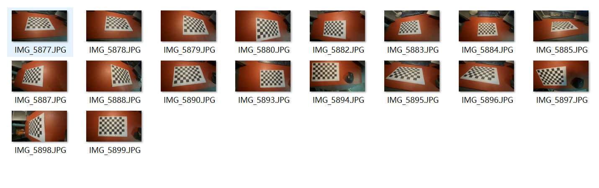
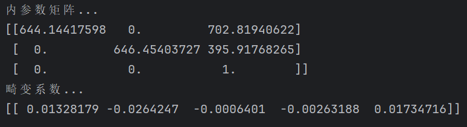
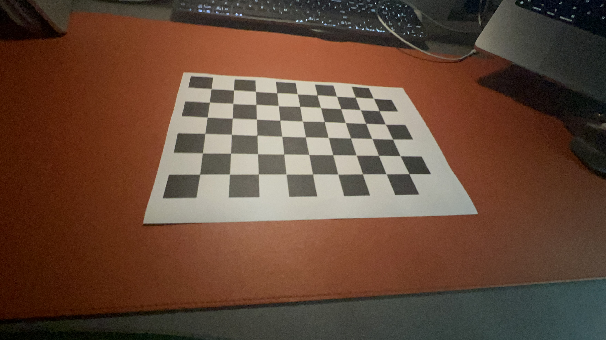
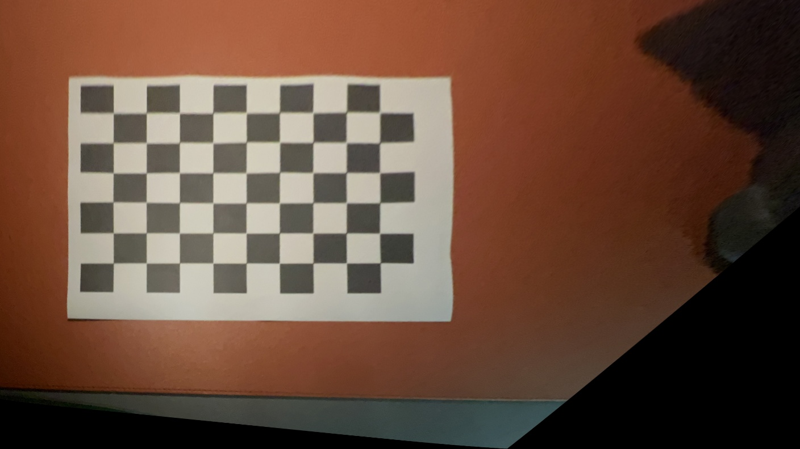

<br/>
<br/>
<br/>
<br/>
<br/>
<br/>
<br/>
<br/>
<br/>
<br/>
<br/>
<br/>

<center>
<center><font face="黑体" size = 100>
    《计算机视觉》实验报告
  </font></center>
  <br/>
<br/>
<br/>
<br/>
<br/>
<br/>
  <center><font face="黑体" size = 5>
    姓名：韩艺轩
  </font></center>
  <center><font face="黑体" size = 5>
    学院：计算机科学与技术学院
  </font></center>
  <center><font face="黑体" size = 5>
    专业：计算机科学与技术（图灵班）
  </font></center>
  <center><font face="黑体" size = 5>
    邮箱：2674361965@qq.com
  </font></center> 
  <center><font face="黑体" size = 5>
    指导教师：宋明黎
  </font></center>
</center>

<center>
<font face="黑体" size = 5>
    报告日期: 2023/12/26
  </font>
</center> 

<div STYLE="page-break-after: always;"></div>
<!-- TOC -->

- [HW4 相机标定 与 鸟瞰视角转换](#hw4-相机标定-与-鸟瞰视角转换)
  - [实验实现的功能简述及运行说明](#实验实现的功能简述及运行说明)
  - [作业的开发与运行环境](#作业的开发与运行环境)
  - [算法的基本思路、原理及流程](#算法的基本思路原理及流程)
    - [相机标定](#相机标定)
    - [畸变矫正](#畸变矫正)
    - [鸟瞰视角转换](#鸟瞰视角转换)
  - [实验结果](#实验结果)
    - [**首先展示原图**](#首先展示原图)
    - [**畸变矫正后的图片**](#畸变矫正后的图片)
    - [**最后鸟瞰视角转换后的图片**](#最后鸟瞰视角转换后的图片)

<!-- /TOC -->
<div STYLE="page-break-after: always;"></div>

# HW4 相机标定 与 鸟瞰视角转换

## 实验实现的功能简述及运行说明

本次实验实现的功能首先是利用相机标定技术获取拍摄照片的设备的参数矩阵，然后在然后优化相机矩阵，在新的相机矩阵上进行畸变矫正，最终利用校正后的相机矩阵完成鸟瞰图视角转换。
全部代码见`camera.py`.
图片资源见`./chessboard`
最后的鸟瞰视图是`./BirdseyeView.jpg`

## 作业的开发与运行环境

- Windows 11
- Pycharm
- opencv-python 4.8.1.78

## 算法的基本思路、原理及流程

### 相机标定

在相机标定时，选取了18张不同角度的标定板的图片，来提高相机参数矩阵的准确度。



在程序中，首先确定标定板的格子数
```python
pattern_size = (9, 6)
```

然后建立建立世界坐标系
```python
objp = np.zeros((pattern_size[0] * pattern_size[1], 3), np.float32)
objp[:, :2] = np.mgrid[0:pattern_size[0], 0:pattern_size[1]].T.reshape(-1, 2)
```

读取标定板图片
```python
calibration_images = ['IMG_5877.JPG', 'IMG_5878.JPG', 'IMG_5879.JPG', 'IMG_5880.JPG', 'IMG_5882.JPG',
          'IMG_5883.JPG', 'IMG_5884.JPG', 'IMG_5885.JPG', 'IMG_5887.JPG', 'IMG_5888.JPG',
          'IMG_5890.JPG', 'IMG_5893.JPG', 'IMG_5894.JPG', 'IMG_5895.JPG', 'IMG_5896.JPG',
          'IMG_5897.JPG', 'IMG_5898.JPG', 'IMG_5899.JPG']
```

一张一张图片的读入，对图片进行重构，然后转换成灰度图，查找标定板的角，并将所有的角在世界坐标系中的点以及在图像上的点添加进相应的列表中。
```python
for fname in tqdm(calibration_images):
    img = cv2.imread(fname)
    img = cv2.resize(img, None, fx=0.4, fy=0.4, interpolation=cv2.INTER_CUBIC)
    gray = cv2.cvtColor(img, cv2.COLOR_BGR2GRAY)

    # 查找标定板角点
    ret, corners = cv2.findChessboardCorners(gray, pattern_size, None)
    # print(corners.shape)
    if ret:
        # 如果找到角点，添加对象点和图像点
        # cv2.cornerSubPix(gray, corners, (11, 11), (-1, -1), criteria)
        objpoints.append(objp)
        imgpoints.append(corners)
```

然后根据世界点和图像点的的列表计算出相机的相关信息，完成相机标定的过程。
```python
ret, mtx, dist, rvecs, tvecs = cv2.calibrateCamera(objpoints, imgpoints, gray.shape[::-1], None, None)
```

观察内参数矩阵和畸变系数



### 畸变矫正

首先根据上一步得到的内参数矩阵和畸变系数获取新的相机矩阵
```python
new_camera_matrix, roi = cv2.getOptimalNewCameraMatrix(mtx, dist, (w, h), 1, (w, h))
```

然后读入一张图片用于鸟瞰视角转换
```python
img = cv2.imread('IMG_5877.JPG')
img = cv2.resize(img, None, fx=0.4, fy=0.4, interpolation=cv2.INTER_CUBIC)
```

然后在这张图片上使用新的相机矩阵进行畸变矫正
```python
h, w = img.shape[:2]
undistorted_img = cv2.undistort(img, mtx, dist, None, new_camera_matrix)
```

### 鸟瞰视角转换

首先获取图片的标定板角点信息
```python
ret, corners = cv2.findChessboardCorners(undistorted_img, pattern_size, None)
```

如果有角点，就需要先计算转换前后的四个角点的位置
```python
    src_points = np.float32([corners[0], corners[pattern_size[0] - 1], corners[-1], corners[-pattern_size[0]]])
    dst_points = np.float32([[200, 200], [w/3+200, 200], [w/3+200, h/3+200], [200, h/3+200]])
```

计算透视变换矩阵
```python
M = cv2.getPerspectiveTransform(src_points, dst_points)
```

应用透视变换
```python
birdseye_img = cv2.warpPerspective(undistorted_img, M, (w, h), flags=cv2.INTER_LINEAR)
```
**最后将生成的图加到同目录下**

## 实验结果

### **首先展示原图**



### **畸变矫正后的图片**


### **最后鸟瞰视角转换后的图片**
