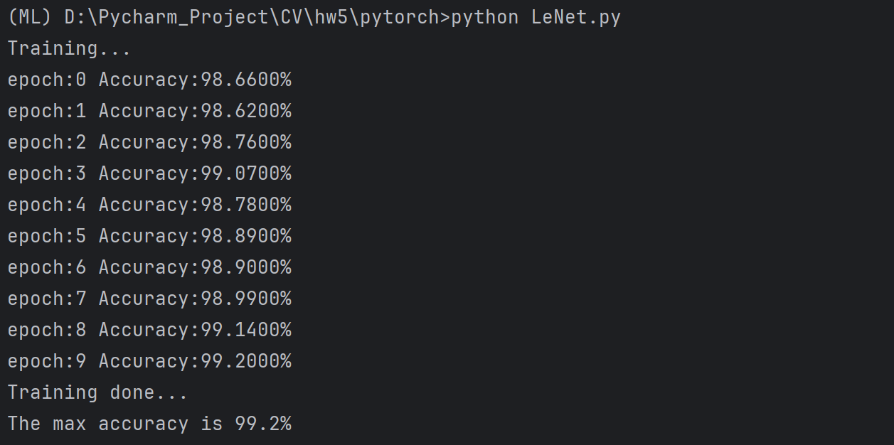

<br/>
<br/>
<br/>
<br/>
<br/>
<br/>
<br/>
<br/>
<br/>
<br/>
<br/>
<br/>

<center>
<center><font face="黑体" size = 100>
    《计算机视觉》实验报告
  </font></center>
  <br/>
<br/>
<br/>
<br/>
<br/>
<br/>
  <center><font face="黑体" size = 5>
    姓名：韩艺轩
  </font></center>
  <center><font face="黑体" size = 5>
    学院：计算机科学与技术学院
  </font></center>
  <center><font face="黑体" size = 5>
    专业：计算机科学与技术（图灵班）
  </font></center>
  <center><font face="黑体" size = 5>
    邮箱：2674361965@qq.com
  </font></center> 
  <center><font face="黑体" size = 5>
    指导教师：宋明黎
  </font></center>
</center>

<center>
<font face="黑体" size = 5>
    报告日期: 2023/12/28
  </font>
</center> 

<div STYLE="page-break-after: always;"></div>
<!-- TOC -->

- [HW5 - CNN 手写数字识别](#hw5---cnn-手写数字识别)
  - [实验实现的功能简述及运行说明](#实验实现的功能简述及运行说明)
  - [作业的开发与运行环境](#作业的开发与运行环境)
  - [算法的基本思路、原理及流程](#算法的基本思路原理及流程)
    - [数据处理](#数据处理)
    - [网络复现](#网络复现)
    - [训练过程](#训练过程)
    - [测试过程](#测试过程)
    - [训练前的准备](#训练前的准备)
  - [实验结果](#实验结果)

<!-- /TOC -->
<div STYLE="page-break-after: always;"></div>

# HW5 - CNN 手写数字识别

## 实验实现的功能简述及运行说明

本次实验通过实现卷积神经网络进行手写数字的识别，并的得到了较高的准确率。
文件：
- data 包括MNIST数据集
- model 保存了训练好的模型
- LeNet.py 主程序

## 作业的开发与运行环境

- OS : Windows 11
- IDE : Pycharm
- pytorch-cuda 11.8
- NVIDIA-SMI 527.37 Driver  Version: 527.37  CUDA Version: 12.0

## 算法的基本思路、原理及流程

### 数据处理

利用 pytorch 的 datasets 得到 MNIST 的数据集，并对数据进行归一化。
```python
transform_test = transforms.Compose([
            transforms.ToTensor(),
            transforms.Normalize((0.1307,), (0.3081,))
        ])
train_data = datasets.MNIST(root='./data', train=True, transform=transform_test, download=False)
test_data = datasets.MNIST(root='./data', train=False, transform=transform_test, download=False)
```

构建能够将数据划分为一个一个 batch 的 Dataloader。
```python
self.train_loader = DataLoader(dataset=train_data, batch_size=batch_size, shuffle=True, num_workers=0)
self.test_loader = DataLoader(dataset=test_data, batch_size=batch_size, shuffle=False, num_workers=0)

```

将对数据的处理集成为一个类。
```python
class Data:
    def __init__(self, batch_size):
        self.batch_size = batch_size

        transform_test = transforms.Compose([
            transforms.ToTensor(),
            transforms.Normalize((0.1307,), (0.3081,))
        ])
        train_data = datasets.MNIST(root='./data', train=True, transform=transform_test, download=False)
        test_data = datasets.MNIST(root='./data', train=False, transform=transform_test, download=False)
        self.train_loader = DataLoader(dataset=train_data, batch_size=batch_size, shuffle=True, num_workers=0)
        self.test_loader = DataLoader(dataset=test_data, batch_size=batch_size, shuffle=False, num_workers=0)

    def get_train_loader(self):
        return self.train_loader

    def get_test_loader(self):
        return self.test_loader
```

### 网络复现

本次实验在 LeNet-5 的基础上又增加了 1 个卷积层， 3 个 bn 层（用于加快收敛），最后使用softmax激活函数。
```python
class LeNet(nn.Module):
    def __init__(self):
        super(LeNet, self).__init__()
        self.max_acc = 0.0
        self.conv1 = nn.Conv2d(1, 16, 5)
        self.bn1 = nn.BatchNorm2d(16)
        self.pool1 = nn.MaxPool2d(2, 2)
        self.conv2 = nn.Conv2d(16, 32, 3)
        self.bn2 = nn.BatchNorm2d(32)
        self.pool2 = nn.MaxPool2d(2, 2)
        self.conv3 = nn.Conv2d(32, 32, 3, padding=1)
        self.pool3 = nn.MaxPool2d(2, 2)
        self.bn3 = nn.BatchNorm2d(32)
        self.fc1 = nn.Linear(128, 120)
        self.fc2 = nn.Linear(120, 84)
        self.fc3 = nn.Linear(84, 10)


    def forward(self, x):
        x = F.relu(self.conv1(x))  # input(1,28,28) output(16,24,24)
        x = self.pool1(x)  # output(16，12，12)
        x = self.bn1(x)
        x = F.relu(self.conv2(x))  # output(32,10.10)
        x = self.pool2(x)  # output(32,5,5)
        x = self.bn2(x)
        x = F.relu(self.conv3(x)) # (32,3,3)
        x = self.pool3(x) # (32,2,2)
        x = self.bn3(x)
        x = x.view(-1, 128)
        x = F.relu(self.fc1(x))
        x = F.relu(self.fc2(x))
        x = self.fc3(x)  # output(10)
        x = F.log_softmax(x, dim=1)
        return x
```

### 训练过程

设置优化器，并确定学习率为0.001，使用CrossEntropyLoss()来计算损失，然后梯度回传，训练时如果连续5次的测试结果是非上升趋势就会终止训练。每次训练完一次，就调运一下测试预测过程，计算准确率。
```python
def train(model, train_dataloader, device, dataset):
    model.train()
    model.to(device)
    criterion = torch.nn.CrossEntropyLoss()
    optimizer = optim.Adam(model.parameters(), lr=0.001)
    print("Training...")
    running_loss = 0.0
    stop = 0
    pre_acc = 0.0
    for epoch in range(10):
        for step, batch_data in enumerate(train_dataloader):
            x, y = batch_data
            x, y = x.to(device), y.to(device)
            out = model(x)
            # print(out.shape)
            loss = criterion(out, y)
            optimizer.zero_grad()
            loss.backward()
            optimizer.step()
            running_loss += loss.item()
            if step % 200 == 0:
                print("epoch={}, step={}, loss={:5f}".format(epoch, step, float(running_loss/200)))
                running_loss = 0.0

        cur_acc = predict(model, dataset.get_test_loader(), device, epoch)
        if cur_acc < pre_acc or cur_acc - pre_acc < 0.0001 or cur_acc < model.max_acc:
            stop += 1
        else:
            stop = 0
        pre_acc = cur_acc

        if stop > 5:
            print("Stop Early...")
            break
```

### 测试过程

测试过程和训练过程类似，只不过不会进行梯度的回传，根据测试集在模型上的输出，选择概率最高的那一类，然后记录正确预测的个数，然后求得准确率。
```python
def predict(model, test_loader, device, epoch):
    model.to(device)
    model.eval()
    correct, total = 0.0, 0.0
    with torch.no_grad():
        for step, batch_data in enumerate(test_loader):
            x, y = batch_data
            x, y = x.to(device), y.to(device)
            outputs = model(x)
            # print(x.shape)
            # exit()
            pred = outputs.max(1, keepdim=True)[1]
            # print(pred.shape)
            # exit()
            total = total + y.size(0)
            correct = correct + pred.eq(y.view_as(pred)).sum().item()
    cur_acc = correct / total
    print('epoch:{} Accuracy:{:.4f}%'.format(epoch, 100.0 * correct / total))
    if cur_acc > model.max_acc:
        model.max_acc = cur_acc
        # print("Max_Acc:{}".format(model.max_acc))
        # torch.save(model, "./model/LeNet.pt")
    return cur_acc

```

### 训练前的准备

设置 batch_size 为32，最终得出最大的准确率。
```python
def main_worker():
    device = torch.device('cuda' if torch.cuda.is_available() else 'cpu')
    model_obj = LeNet()
    dataset = Data(32)
    train(model_obj, dataset.get_train_loader(), device, dataset)
    print("Training done...")
    print("The max accuracy is {}%".format(model_obj.max_acc * 100))
```

## 实验结果

10次迭代最大测试结果准确率为 99.2 %

